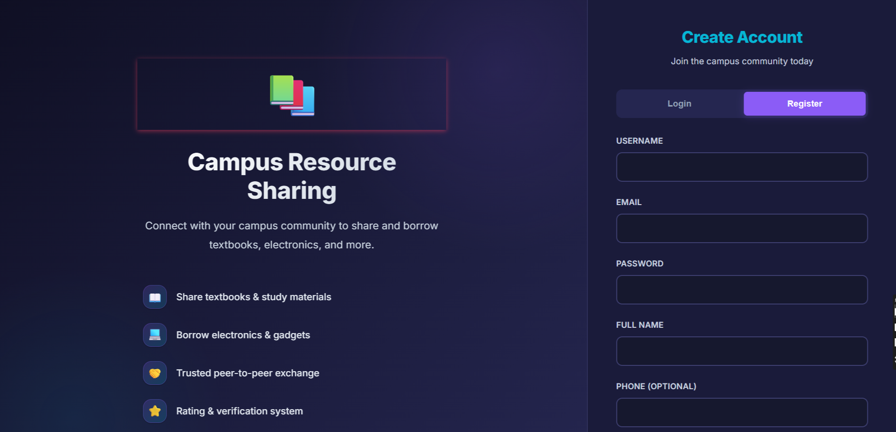
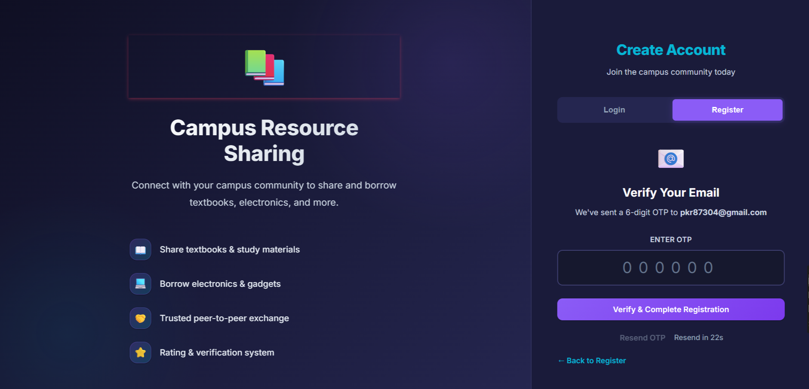
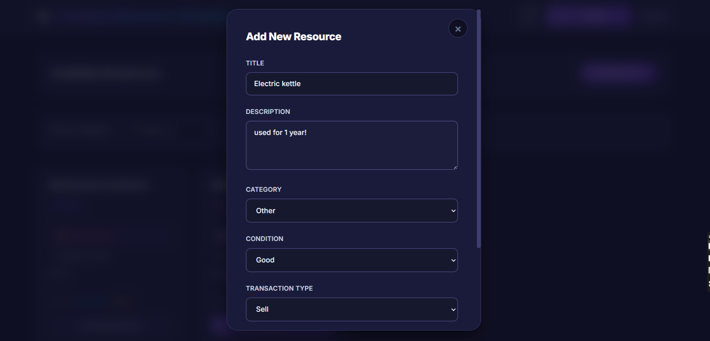
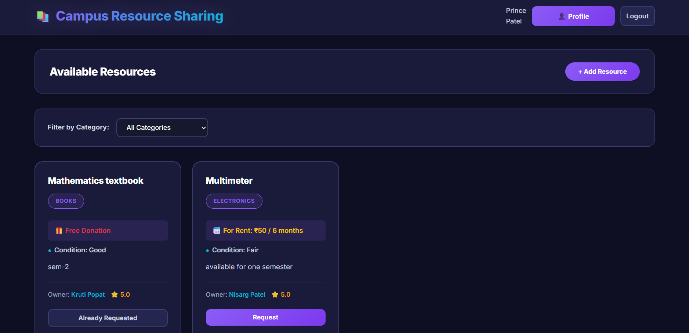
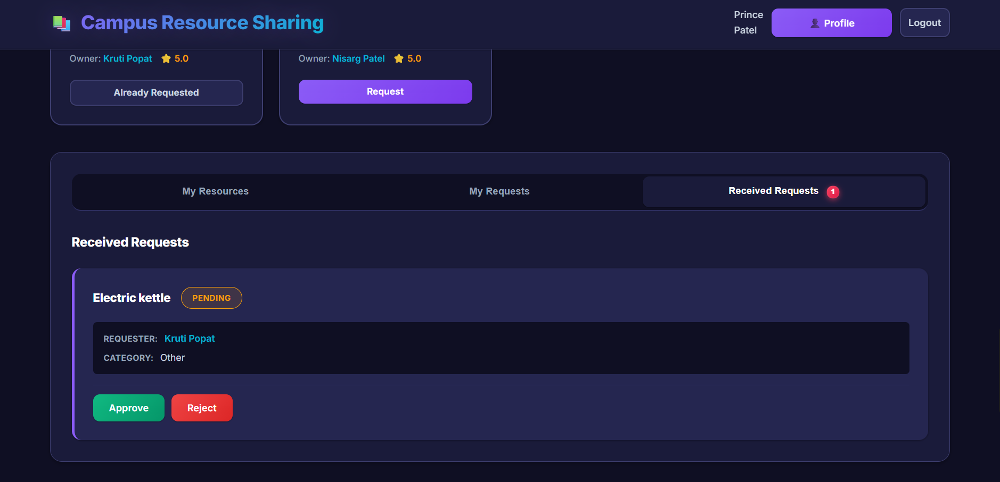
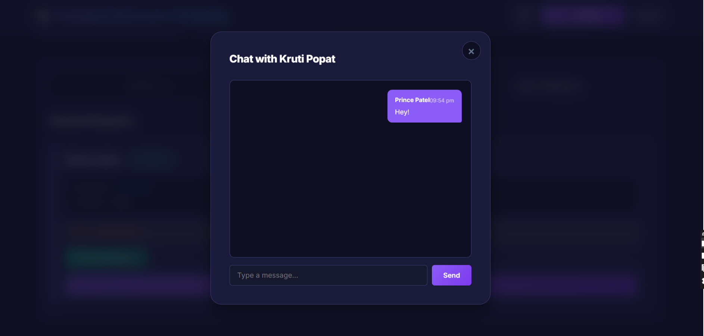

# 📚 Campus Resource Sharing Platform

A modern, feature-rich web application that enables students to share, request, and exchange resources within their campus community. Built with Spring Boot backend and responsive frontend.

## 🌟 Features

### Core Functionality
- **🎓 User Authentication** - Secure login/registration with OTP verification
- **📦 Resource Management** - Add, edit, and manage shared resources
- **🤝 Request System** - Request resources with approval workflow
- **💬 Real-time Chat** - Built-in messaging between resource owners and requesters
- **⭐ Rating System** - Rate and review users after successful exchanges
- **🔔 Unread Messages** - WhatsApp-style badge notifications for new messages

### Advanced Features
- **🎨 Modern UI/UX** - Dark theme with layered colors and smooth animations
- **📱 Responsive Design** - Works perfectly on desktop, tablet, and mobile
- **🔍 Advanced Filtering** - Filter resources by category, condition, and type
- **📊 User Dashboard** - Personal dashboard with all activities
- **🔒 Secure API** - RESTful API with proper validation and error handling

## 🏗️ Architecture

### Backend (Spring Boot)
- **Java 17** with Spring Boot 3.x
- **Spring Security** for authentication
- **Spring Data JPA** with PostgreSQL
- **JWT** for secure authentication
- **RESTful APIs** with proper validation

### Frontend (Vanilla JavaScript)
- **Modern CSS** with custom properties and animations
- **Responsive Grid** layouts
- **Real-time Updates** with periodic API calls
- **Component-based** structure
- **No Framework Dependencies** - Pure HTML/CSS/JavaScript

### Database
- **MySQL** for relational data
- **Optimized schema** with proper indexing
- **Relationships** between users, resources, requests, and messages

## 🚀 Quick Start

### Prerequisites
- Java 17+
- Maven 3.6+
- MySQL 8.0+

### Installation

```bash
# Clone and run
git clone https://github.com/kruti-popat/campus-resource-sharing.git
cd campus-resource-sharing
./mvnw spring-boot:run
```

Create MySQL database and update credentials in `src/main/resources/application.properties`

## 📸 Screenshots













## 📡 API Documentation

### Authentication
```http
POST /api/auth/register
POST /api/auth/login
POST /api/auth/verify-otp
```

### Resources
```http
GET /api/resources
POST /api/resources
PUT /api/resources/{id}
DELETE /api/resources/{id}
```

### Requests
```http
GET /api/requests
POST /api/requests
PUT /api/requests/{id}/approve
PUT /api/requests/{id}/reject
```

### Chat & Messages
```http
GET /api/chat/messages?requestId={id}&userId={id}
POST /api/chat/send
GET /api/chat/unread-count?requestId={id}&userId={id}
GET /api/chat/all-unread-counts?userId={id}
```

### Ratings
```http
GET /api/ratings
POST /api/ratings
GET /api/ratings/user/{userId}
## 🔧 Configuration
```

Configure database connection in `src/main/resources/application.properties`

---

**Built for our campus community** 🎓
